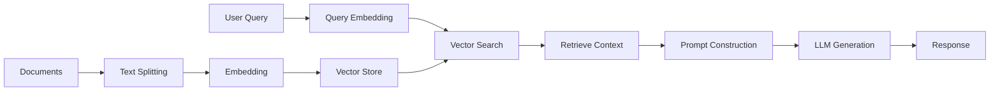

# RAG Architecture Guide

Retrieval-Augmented Generation (RAG) combines the power of large language models with external knowledge retrieval to provide more accurate, up-to-date, and contextually relevant responses.

## Core Components

### 1. Knowledge Base
The foundation of any RAG system:
- **Document Storage**: Raw documents, PDFs, web pages
- **Vector Database**: Embedded representations for similarity search
- **Metadata**: Additional context (source, date, category)

### 2. Embedding Models
Convert text into vector representations:
- **Text Embeddings**: OpenAI, Sentence Transformers, Ollama
- **Multimodal**: CLIP for images, specialized models for audio
- **Dimensionality**: Typically 384-1536 dimensions

### 3. Vector Search
Retrieve relevant context:
- **Similarity Metrics**: Cosine, Euclidean, Dot Product
- **Hybrid Search**: Combine vector and keyword search
- **Filtering**: Metadata-based filtering

### 4. Language Model
Generate responses using retrieved context:
- **Local Models**: Ollama (Llama, Mistral, etc.)
- **API Models**: OpenAI GPT, Anthropic Claude
- **Specialized**: Code models, domain-specific models

## RAG Pipeline



## Implementation with This Stack

### Basic RAG Pipeline

```python
from pymongo import MongoClient
from langfuse import Langfuse
import requests
import openai

class RAGPipeline:
    def __init__(self):
        self.mongo_client = MongoClient('mongodb://your-host:27017/')
        self.collection = self.mongo_client.rag_database.documents
        self.langfuse = Langfuse(host="http://your-host:3000")
        self.ollama_url = "http://your-host:11434"
    
    def embed_query(self, query: str) -> list:
        """Generate embedding for query"""
        response = requests.post(
            f"{self.ollama_url}/api/embeddings",
            json={"model": "nomic-embed-text", "prompt": query}
        )
        return response.json()["embedding"]
    
    def retrieve_context(self, query: str, k: int = 5) -> list:
        """Retrieve relevant documents"""
        query_embedding = self.embed_query(query)
        
        pipeline = [
            {
                "$vectorSearch": {
                    "index": "vector_index",
                    "queryVector": query_embedding,
                    "path": "embedding",
                    "numCandidates": k * 10,
                    "limit": k
                }
            },
            {
                "$addFields": {
                    "score": {"$meta": "vectorSearchScore"}
                }
            },
            {
                "$project": {
                    "content": 1,
                    "metadata": 1,
                    "score": 1
                }
            }
        ]
        
        return list(self.collection.aggregate(pipeline))
    
    def generate_response(self, query: str, context: list) -> str:
        """Generate response using retrieved context"""
        context_text = "\n\n".join([doc["content"] for doc in context])
        
        prompt = f"""Based on the following context, please answer the question.
        
Context:
{context_text}

Question: {query}

Answer:"""
        
        response = requests.post(
            f"{self.ollama_url}/api/generate",
            json={
                "model": "llama3.2:3b",
                "prompt": prompt,
                "stream": False
            }
        )
        
        return response.json()["response"]
    
    def query(self, question: str) -> dict:
        """Complete RAG pipeline"""
        trace = self.langfuse.trace(name="rag_query", input=question)
        
        # Retrieve context
        context = self.retrieve_context(question)
        trace.span(name="retrieval", output=context)
        
        # Generate response
        response = self.generate_response(question, context)
        trace.span(name="generation", output=response)
        
        trace.update(output=response)
        
        return {
            "question": question,
            "response": response,
            "context": context,
            "sources": [doc["metadata"] for doc in context]
        }
```

## Advanced RAG Patterns

### 1. Multi-Step Reasoning
```python
def multi_step_rag(query: str):
    # Step 1: Decompose query
    sub_queries = decompose_query(query)
    
    # Step 2: Retrieve for each sub-query
    all_context = []
    for sub_query in sub_queries:
        context = retrieve_context(sub_query)
        all_context.extend(context)
    
    # Step 3: Synthesize response
    return generate_response(query, all_context)
```

### 2. Graph RAG
```python
from neo4j import GraphDatabase

def graph_enhanced_rag(query: str):
    # Vector retrieval
    vector_context = retrieve_context(query)
    
    # Extract entities from context
    entities = extract_entities(vector_context)
    
    # Graph traversal
    graph_context = traverse_knowledge_graph(entities)
    
    # Combine contexts
    combined_context = vector_context + graph_context
    
    return generate_response(query, combined_context)
```

### 3. Iterative Refinement
```python
def iterative_rag(query: str, max_iterations: int = 3):
    response = None
    context = []
    
    for i in range(max_iterations):
        # Retrieve additional context
        new_context = retrieve_context(query, context_so_far=context)
        context.extend(new_context)
        
        # Generate response
        response = generate_response(query, context)
        
        # Check if response is sufficient
        if is_sufficient(response, query):
            break
            
        # Refine query for next iteration
        query = refine_query(query, response)
    
    return response
```

## Quality Metrics

### Retrieval Quality
- **Precision@K**: Relevant documents in top K results
- **Recall@K**: Coverage of relevant documents
- **MRR**: Mean Reciprocal Rank of first relevant document

### Generation Quality
- **Faithfulness**: Response accuracy to source material
- **Relevance**: Answer relevance to question
- **Completeness**: Information coverage

### Implementation with Langfuse
```python
def evaluate_rag_response(question: str, response: str, context: list):
    trace = langfuse.trace(name="rag_evaluation")
    
    # Faithfulness check
    faithfulness_score = check_faithfulness(response, context)
    trace.score(name="faithfulness", value=faithfulness_score)
    
    # Relevance check
    relevance_score = check_relevance(question, response)
    trace.score(name="relevance", value=relevance_score)
    
    return {
        "faithfulness": faithfulness_score,
        "relevance": relevance_score
    }
```

## Optimization Strategies

### 1. Chunk Optimization
- **Size**: Balance context vs. specificity (200-800 tokens)
- **Overlap**: Prevent context loss at boundaries
- **Structure**: Respect document structure (paragraphs, sections)

### 2. Embedding Strategies
- **Model Selection**: Task-specific vs. general-purpose
- **Fine-tuning**: Domain-specific embeddings
- **Hybrid Approaches**: Multiple embedding models

### 3. Retrieval Enhancement
- **Query Expansion**: Synonyms, related terms
- **Reranking**: Re-score retrieved documents
- **Metadata Filtering**: Time, source, topic constraints

## Common Pitfalls

1. **Poor Chunking**: Losing context at boundaries
2. **Embedding Mismatch**: Query vs. document embedding models
3. **Context Length**: Exceeding model limits
4. **Hallucination**: Model generating unsupported information
5. **Retrieval Noise**: Irrelevant documents affecting generation

## Resources

- [RAG Paper](https://arxiv.org/abs/2005.11401)
- [LangChain RAG Tutorial](https://python.langchain.com/docs/tutorials/rag/)
- [Evaluation Frameworks](https://docs.ragas.io/)
- [Advanced RAG Techniques](https://blog.langchain.dev/semi-structured-multi-modal-rag/)